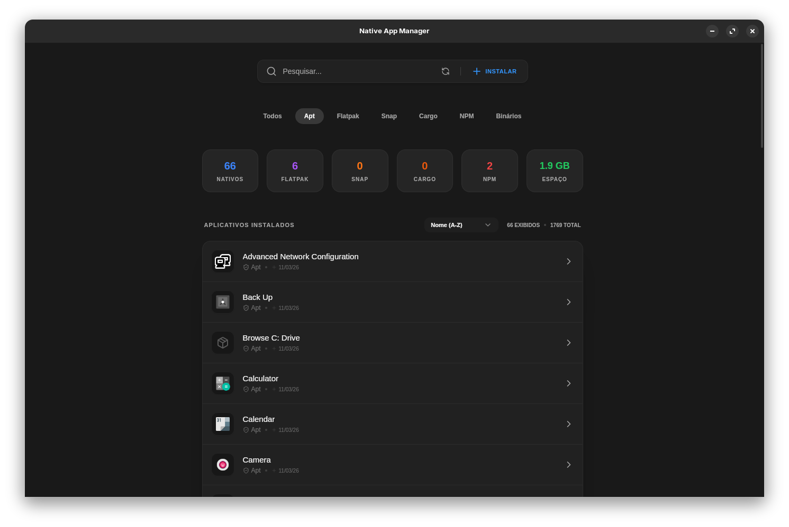

<div align="center">
  
  <h1>Native App Manager</h1>
  <p><strong>A forma moderna e minimalista de gerenciar e limpar seus aplicativos Linux.</strong></p>

  []()
  []()
  [](https://tauri.app/)
  [](LICENSE)

  <p><br><em><a href="README-en.md">🇺🇸 Read in English</a></em></p>
</div>

<hr />



## 🚀 Visão Geral

O **Native App Manager** é um gerenciador de aplicativos de alto desempenho para Linux, focado em resolver o problema dos "arquivos residuais". Enquanto os gerenciadores de pacotes tradicionais removem apenas os binários, eles costumam deixar para trás gigabytes de configurações, cache e dados locais.

Esta ferramenta fornece uma interface centralizada e minimalista para gerenciar um ecossistema gigantesco de pacotes, apresentando um motor de limpeza inteligente que varre o sistema de arquivos para recuperar espaço desperdiçado.

## ✨ Principais Funcionalidades

### 📦 Gerenciamento Universal de Pacotes
Um único painel para todos. Chega de alternar entre ferramentas de linha de comando. O Native App Manager detecta automaticamente o seu sistema e suporta:
- **Gerenciadores de Sistema:** `APT` (Debian/Ubuntu), `DNF` (Fedora), `Pacman` (Arch) e `Zypper` (OpenSUSE).
- **Formatos Universais:** `Flatpak` e `Snap`.
- **Linguagens e Ferramentas:** `Cargo` (Rust) e pacotes globais do `NPM` (Node.js).
- **Apps Nativos:** Binários estáticos, `AppImages` e arquivos `.desktop` locais.

### 🧹 Desinstalador Inteligente
Ao desinstalar um app, o Native App Manager não para no nível do pacote. Ele utiliza um algoritmo heurístico avançado em Rust para varrer diretórios padrão (`~/.config`, `~/.cache`, `~/.local/share`, etc.) em busca de arquivos remanescentes.

### 📊 Uso de Disco em Tempo Real
Veja de forma transparente quanto espaço cada item residual ocupa. A interface fornece um resumo ao vivo do armazenamento recuperável, permitindo que você tome decisões informadas sobre o que excluir.

### 🎨 Design Minimalista Estilo Adwaita
Inspirado na estética do **Zorin OS** e do **GNOME Settings**.
- **Padrões de Lista em Caixa**: Categorização limpa e estruturada.
- **Tema "Deep Black"**: Otimizado para ambientes Linux modernos e telas OLED.
- **Busca Centralizada**: Fluxo de trabalho focado e livre de distrações.

### ⚡ Alta Performance e Experiência Nativa
- **Velocidade Extrema:** Uso do Tokio e `spawn_blocking` no backend Rust para operações assíncronas em threads paralelas. Possui um cache em memória global (`OnceLock`) para indexação de ícones O(1), processando milhares de ícones instantaneamente.
- **Renderização Inteligente:** Utilização de `IntersectionObserver` e paginação dinâmica (infinite scroll) no React para garantir que apenas o que está na tela seja renderizado, mantendo a estabilidade e fluidez.
- **Desktop Feel:** Comportamento e integração nativa, com o bloqueio de seleção de texto (`user-select: none`) e desativação do menu de contexto padrão do navegador (`contextmenu`), além de animações fluidas baseadas no `Framer Motion`.

### 🔗 Integração Profunda com o Sistema
- **Sincronização do Desktop Database**: Atualiza instantaneamente os ícones do seu lançador de aplicativos através do `update-desktop-database`.
- **Atualização do AppGrid**: Mantém o GNOME Shell sincronizado com suas mudanças (`Main.overview.refreshAppGrid()`).
- **Elevação de Privilégio (pkexec)**: Execução segura para comandos administrativos quando necessário (remoção de arquivos no `/usr/`).

## 🛠️ Tecnologias Utilizadas

- **Motor Principal**: [Tauri v2](https://tauri.app/) (Rust) para acesso seguro e de alto desempenho ao sistema.
- **Frontend**: [React.js](https://reactjs.org/) + [TypeScript](https://www.typescriptlang.org/) empacotado pelo [Vite](https://vitejs.dev/).
- **Estilização e Componentes**: [Tailwind CSS](https://tailwindcss.com/) + [Shadcn/UI](https://ui.shadcn.com/) (Radix UI).
- **Animações e Ícones**: [Framer Motion](https://www.framer.com/motion/) e [Lucide React](https://lucide.dev/).

## 🛠️ Desenvolvimento e Compilação

### Pré-requisitos
- [Rust](https://www.rust-lang.org/)
- [Node.js / pnpm](https://pnpm.io/)
- Dependências do sistema: `libwebkit2gtk-4.1-dev`, `build-essential`, `curl`, `wget`, `file`, `libssl-dev`, `libgtk-3-dev`, `libayatana-appindicator3-dev`, `librsvg2-dev`.

### Executar em Modo de Desenvolvimento
```bash
pnpm tauri dev
```

### Gerar Pacote de Produção
```bash
pnpm tauri build
```


---

<div align="center">
  <p>Native App Manager - Limpeza Sem Esforço, Gerenciamento Superior.</p>
</div>

